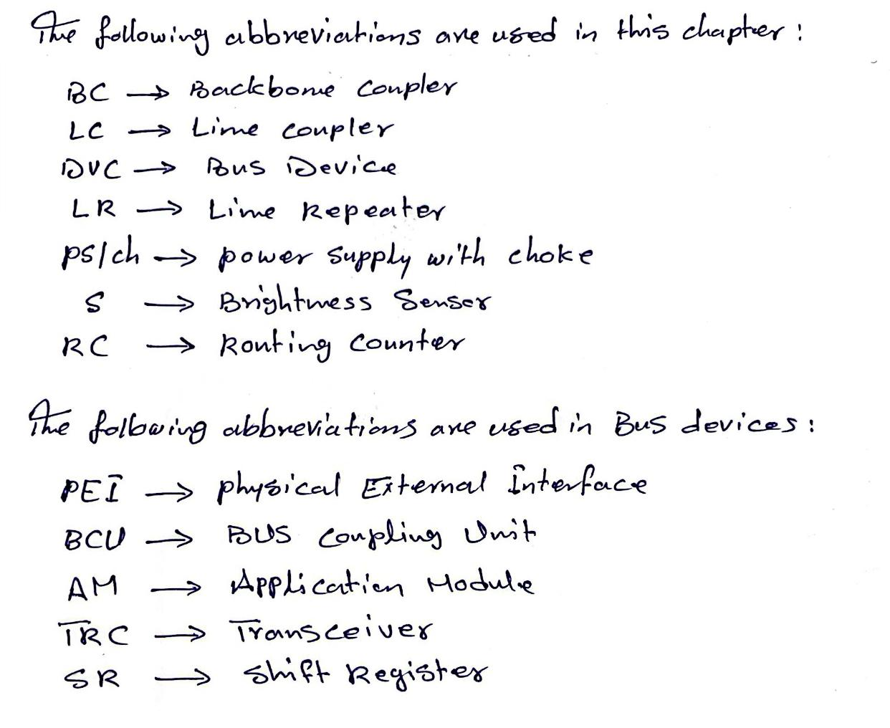
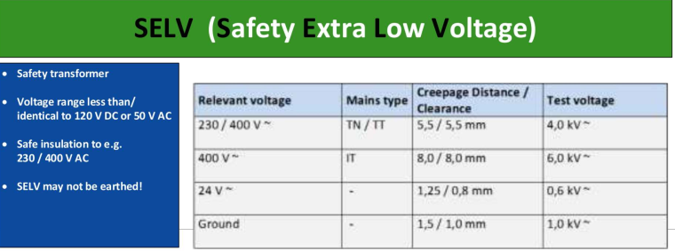
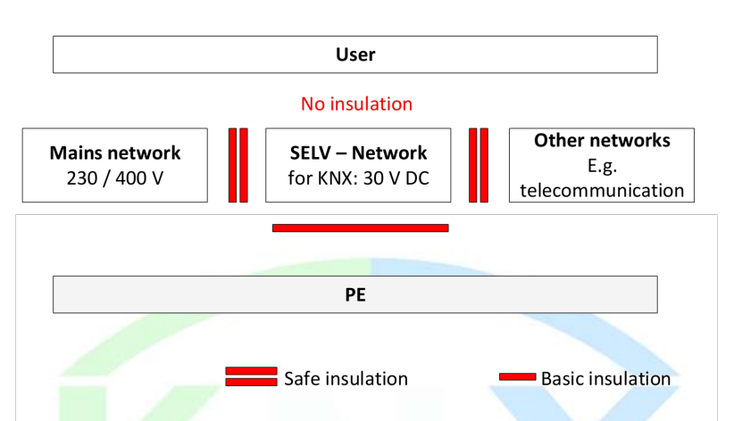
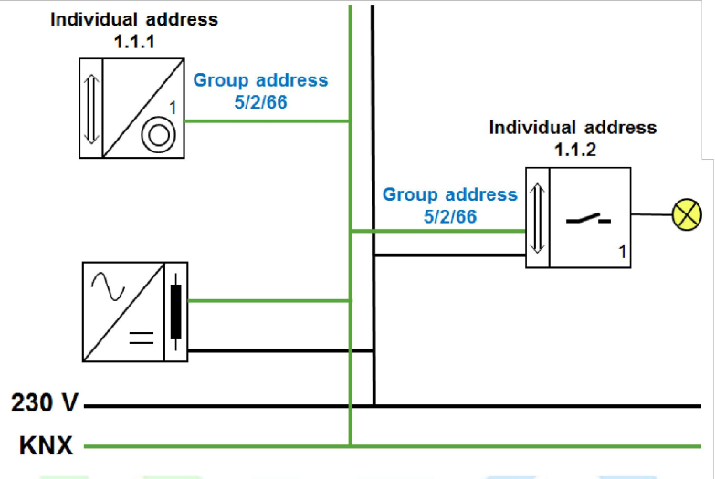
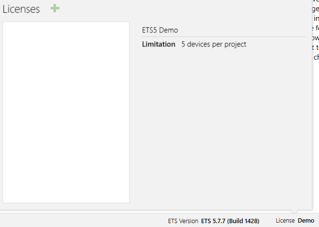
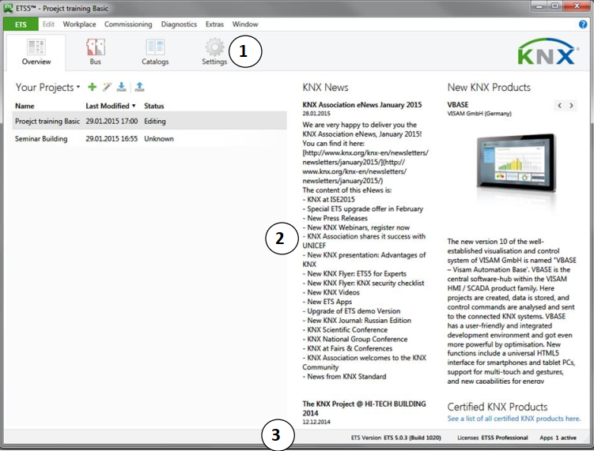

# KNX_Home_Automation
This repo is dedicated to the KNX system including ACS experience in configuration, commissioning, integration, and troubleshooting.

## 📚Table of contents

### __Inroduction to KNX__

KNX is an open standard for home and building automation that provides seamless integration and interoperability for smart systems.

#### __KNX TP Topology__

##### __Topology- Overall view__

Max topological size of a KNX TP installation:
 
 Primary line -> refers to the upper segment of a line or backbone coupler
      
      - Line coupler -> main line
      - IP router -> IP side

Secondary line -> refers to the lower segment of a line or backbone coupler

     - Line coupler -> line itself
     - IP router -> TP side

The main abbreviations are used:

##### __Topology Line__

Max. 256 devices can be mounted in one line.

Each DVC acn exchange information with any other device and each line requires its own ps/ch.

The no. of devices per line depends on the ps/ch selected and the power required for each device.

##### __Topology Area__

If more devices need to be mounted than one can fit into one line, then up to 15 lines can be connected to the main line via line couplers LC.

The max number of DVC in the main line decreases due to the energy consumption by the number of mounted LCs.

LR may not be used in main lines.

It is possible to topologically address max 256 bus devices on the main line including the mounted LR.

##### __Topology Network__

If more devices have to be mounted, then the TP installation can be extended by mounting BCs to the backbone line.

The max. number of DVC on the backbone line decreases due to the energy consumption by the no. of mounted BCs.

The backbone lines requires its own ps/ch and also may not be used a LRs.

##### __Individual Address__

The individual address identify the bus device and describes its location within the topology.

     - A -> addresses the areas 1...15
     - A -> addresses the DVC on BL 0
     - A -> only 4 bits -> half byte
     - L -> addresses the lines 1...15
     - L -> addresses the main line of respective area 0
     - L -> only 4 bits
     - B -> addresses the DVCs on the line defined by L 0...255
     - B -> addresses the coupler in respective line 0
     - B -> 8 bits -> 1 byte

The individual address of an unloaded bus device is 15.15.255.

##### __Coupler-Gate Function__

If a coupler is used in the installation and the correct individual addresses are assigned to the couplers, a filter table will auto created in ETS file for the respective couplers.

The filter table contains the active line-crossing group addresses.

The coupler routes aal received droup addresses if these are listed in its filter table.

The LR used in installation passes on all telegrams has no filter table.

##### __Coupler-Block Diagram__

The LC can be programmed both from the primary line as well as the secondary line.

The couplers are supplied from the primary line and only have one controller. This make the coupler can report secondary line power-down.

##### __Coupler-Fields of Application__

BC, LC and LR are identical devices -> their tasks depend on the location and individual address.

     - BC -> connection between BL and main line.
     - LC -> connection between main line and secondary L
     - LR -> for extended a line by a line segment with up to 64 additional DVC and 1000 m cable length.

BC and LC only forward line-crossing telegrams.

LR does not have filter table so it passes all telegrams.

##### __Connection of several lines__

In an installation consisting of several lines, each line or each line segment must have its own ps/ch.

##### __Internal line diagram__

By press PB P1, sends a telegram with group address of 5/2/66.

Despite all DVCs get the telegram when it is transmitted, only the actuators of L11,L12,and L13 with the same group addresses execute the command.

##### __Line-crossing telegram__

If S1 is not connected in the same line as the lamp it has to control, it is necessary to transmit its telegrams via the main line.

All DVCs on this line listen to the telegram from S1, but only the actuator controlling the lights L11 & L21 execute the command.

##### __Area-crossing telegram__

If S1 is mounted in another area, it can still address all bus devices via backbone line.

If 0/2/11 is assigned to S1, the telegram is routed to line 1 via BC1 and BC2 and LC1.

##### __Coupling unit: Routing center__

The telegram transmitted by sending device contains a routing center, of which the initial value is 6.

Each line -/ BC or LR decrements the routing center and passes the telegram as long as the value has not reached 0

##### __Internal and External interfaces__

KNX is open to be linked to any other system. the BL can be connected via a gateway unit.

Media couplers connect different types of KNX media -> TP or RF

##### __Backbone-/ LC classical structure__

##### __Taking into account higher telegram rates: IP Network__

Replacement of LCs by KNXnet/IP routers is the increased telegram load, which can occur when the user makes use of visualization SW and devices with higher no. of channels.

##### __LC replaced by KNXnet/IP__

Case 1 -> The KNXnet/Ip router can be used as a LC as well as a BC. If the KNXnet/IP router replaces LC, all main lines and basically also the BLs are replaced by Ethernet.

Case 2 -> If BCs are replaced by KNXnet/IP routers, the normal LCs can remain, as only the backbone line is replaced by Ethernet.

#### __KNX RF__

KNX RF allows the wireless transmission of telegrams by means of the medium radio frequency.

##### __The RF transmission medium__

The range of KNX RF components is indicated as free-filed range. Due to max transmission power and limitations of energy availabe in case of battery-operated, the free feild range is limited to 100 m.

KNX RF uses 868 MHz frequency band.

##### __KNX Ready(Single-channel solution)__

1.png>)

2.png>)

##### __KNX-RF Multi(multi-channel solution)__

.png>)

##### __Cobination of transmission mdeia__

#### __KNX Bus device__

A functioning bus device (dimming/shutter actuator) consists of 3 interconnecting parts:

     - BCU -> Bus Coupling Unit
     - AM -> Application Module
     - AP -> Application Program

#### __KNX TP Installation__

##### __Safety Low Voltage Networks__

Permitted voltage range:

     Alternating current -> <= 50V
     Direct current -> <= 120V

⚠️ A SELV network may not be earthed!

##### __SELV Safety Low Voltage Network__

A PS with secure mains seperation generates the SELV voltage for KNX TP bus.

Voltage used -> 30 VDC

##### __Types of bus cables__

     - YCYM 2x2x0.8 -> outdoors -> test voltage: 4Kv
     - J-Y(st) 2x2x0.8 -> outdoors -> test voltage: 2.5Kv

The requirements for instance include a loop resistance of 75 ohm and a loop capacitance of 100 nF per 1000 m.

##### __Installation of cables__

The requirements for installaiton of bus cables are the same as for installaiotn of 230/400 VAC networks.

A min clearance space of 4mm must be observed between the insulated wire cores of KNX TP bus and those of sheathed 230 VAC.

##### __Bus devices on distribution boards__

     1. Use of standardised distribution boards.
     2. Install bus cables with sheath up to the terminal.
     3. Do not install bus devices above mains devices with significant power losses.
     4. Cover unused section of data rail.

##### __Power Supply unit__

Bus devices require a min of 21 VDC for safe operation.

##### __Power supply for two lines__

##### __Two power supply units in one line__

##### __Distributed power supply__

##### __Checking the installation__

##### __Power supply unit with data rail__

##### __Power supply unit for two lines with data rail__

#### __KNX System Overview__

##### __Minimal structure of a KNX TP installation and addressing__

##### __Cable lengths__

#### __KNX project design ETS5:Basics__

##### __Installation of ETS__

You can only obtain ETS from from KNX assosiation via internet in the KNX online shop : https://www.knx.org/knx-en/for-professionals/index.php

##### __Licences__

There are 4 versions availabel:

1- Demo -> Full functionality max 5 devices per project.

2- Lite -> Full functionality max 20 devices per project.

3- Professional -> Full functionality, no restrictions as regards no. of devices.

4- Supplemntary -> Additional licence for professional on a second PC.

##### __Starting ETS__

1- A bar with tabs for different functions of dashboard.

2- The workspace with the functions selsected by means of the tabs.

3- A status bar with info of ETS, to licences and apps.

##### __Dashboards Tabs__

###### __Overview tab__

Window area ->  you can select the project that is to be
edited or you can create a new project.

Area ->  up-to-date news on KNX Association is
displayed provided that ETS is connected to the internet.

###### __Project properties__

shows how you can access the properties of a project by clicking on a project. You can also import and export projects by means of this window. 

###### __Tab Bus__

